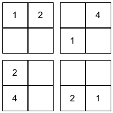
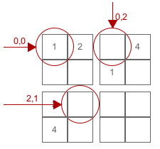
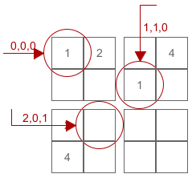

# Sudoku 

## Ubiquitous Language

**Board** - the matrix of *cells*. This is a **`2x2` board** which results a **`4x4` grid**. 

**Grid-Cell Indexing** - `[vertical, horizontal]`  

**Board-Cell Indexing** - `[block, vertical, horizontal]`

